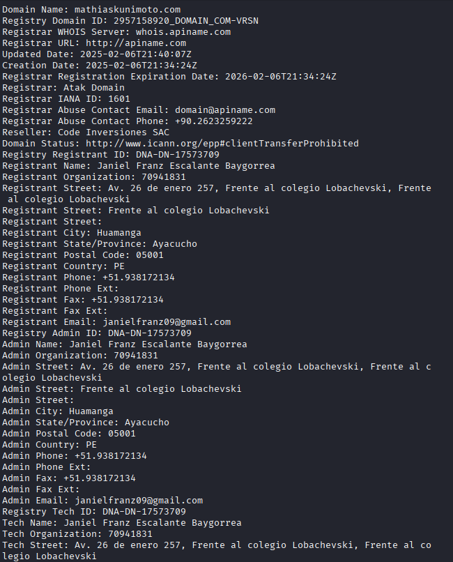
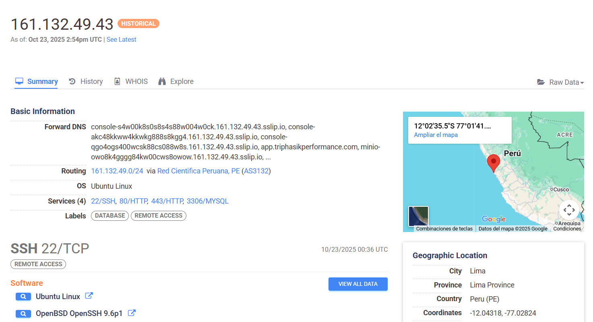

# Sprint 1 — Reconocimiento y Escaneo 

## Evidencia inicial
Durante el Sprint 1 se recopilaron evidencias de los dominios relacionados con el proyecto **RaymiFest** y su autor técnico.  
Todos los archivos fueron almacenados en la carpeta `Sprint1_Evidencias/` y documentados en el inventario general.

**Archivos principales:**
- `whois_mathiaskunimoto.txt` — Datos WHOIS del dominio `mathiaskunimoto.com`.
- `whois_raymifest.txt` — WHOIS con privacidad activa (`Spaceship, Inc.`).
- `whois_triphasikperformance.txt` — WHOIS con privacidad (`Tucows / SiteGround`).
- `nmap_raymifest.*` — Escaneo de `raymifest.com` (RootServerCloud).
- `nmap_mathiaskunimoto.*` — Escaneo de `mathiaskunimoto.com` (mismo host que Raymifest).
- `nmap_apptriphasik.*` — Escaneo de `app.triphasikperformance.com` (Hetzner).
- `censys_161.132.49.43.png` — Snapshot Censys (entorno anterior).

---

## Estructura de targets
<table>
<thead>
<tr><th>Target</th><th>IP</th><th>Proveedor</th><th>Notas</th></tr>
</thead>
<tbody>
<tr><td>raymifest.com</td><td>23.239.27.53</td><td>RootServerCloud</td><td>Servidor principal del sitio, hosting compartido</td></tr>
<tr><td>mathiaskunimoto.com</td><td>23.239.27.53</td><td>RootServerCloud</td><td>Mismo servidor que Raymifest, asociado al autor</td></tr>
<tr><td>app.triphasikperformance.com</td><td>91.98.70.94</td><td>Hetzner (your-server.de)</td><td>Hosting activo de la aplicación</td></tr>
<tr><td>app.triphasikperformance.com (snapshot)</td><td>161.132.49.43</td><td>Censys / Lima, Perú</td><td>Infraestructura anterior detectada</td></tr>
<tr><td>triphasikperformance.com</td><td>(variable)</td><td>SiteGround / Tucows</td><td>Dominio principal con privacidad WHOIS</td></tr>
</tbody>
</table>

**Archivo de soporte:** [`inventario_activos_sprint1.xlsx`](Evidencias/inventario_activos_sprint1.xlsx)

---

## Reconocimiento Pasivo

### 🔹 Análisis WHOIS
- **mathiaskunimoto.com:**  
  Registrante identificado como **Janiel Franz Escalante Baygorrea**, ubicado en **Huamanga, Ayacucho (PE)**. <br>
  *Datos personales por completo expuestos incluyendo Telefono, Direccion, Codigo postal, correo electronico y Documento Nacional de Identidad (DNI)* <br>
  *Riesgo:* exposición de datos personales en registro público.  
  **Archivo:** `whois_mathiaskunimoto.txt`<br>


- **raymifest.com:**  
  Registro reciente (16 ago 2025), con privacidad activa mediante **Withheld for Privacy ehf (IS)**.  
  **Archivo:** `whois_raymifest.txt`

- **triphasikperformance.com:**  
  Registro el 28 ene 2025 — proveedor **Tucows / SiteGround España** — privacidad habilitada.  
  **Archivo:** `whois_triphasikperformance.txt`

### Observaciones de OSINT
- El sitio `raymifest.com` incluye en su pie de página la frase *“Desarrollado por Mathias Kunimoto (CEO de virtuolabs)”*, vinculando al dominio del autor `mathiaskunimoto.com`.  
- Censys evidenció dos IPs históricas para `app.triphasikperformance.com`:
  - **161.132.49.43 (Perú)** — Snapshot anterior, HTTP 503 y MySQL 5.7.44.  
  - **91.98.70.94 (Alemania, Hetzner)** — Infraestructura actual con Caddy y MySQL 8.4.6.
  - [Censys](https://search.censys.io/hosts/161.132.49.43?q=services.http.request.uri%3D%22http%3A%2F%2F161.132.49.43%2F%22&resource=hosts&at_time=2025-10-23T14%3A54%3A18.730Z)


*Se realizó Google dorking enfocado en los dominios investigados para buscar endpoints públicos, backups, paneles de administración o documentos expuestos.*
**Resultado: únicamente se localizó el endpoint de acceso de WordPress en triphasikperformance.com:**
https://triphasikperformance.com/wp-login.php

---

## Escaneo de red (Nmap) — perfil conservador

Los escaneos se realizaron con **perfil conservador (-T2)** para minimizar impacto y detección.  
Herramientas utilizadas: `Nmap 7.95` y scripts de detección de banner.

**Comando base:**
```bash
nmap -sS -sV -T2 -Pn --min-rate 50 --max-retries 2 \
-p 21,22,53,80,110,143,443,465,587,993,995,3306,5432,8080 <target> \
-oA Sprint1_Evidencias/nmap_<target>
```
Resultados relevantes:

<table> <thead> <tr><th>Target</th><th>Puertos abiertos</th><th>Servicios detectados</th><th>Observaciones</th></tr> </thead> <tbody> <tr><td><b>raymifest.com</b></td><td>21, 22, 53, 80, 110, 143, 443, 465, 587, 3306, 8080</td><td>Pure-FTPd, OpenSSH 7.4, PowerDNS 4.7.3, Exim, Dovecot, MariaDB 10.6.18</td><td>Servidor multi-servicio</td></tr> <tr><td><b>mathiaskunimoto.com</b></td><td>22, 80, 443, 3306, 8080</td><td>OpenSSH 7.4, MariaDB 10.6.18</td><td>Mismo servidor que Raymifest</td></tr> <tr><td><b>app.triphasikperformance.com</b></td><td>22, 80, 443, 3306, 5432</td><td>Caddy httpd, MySQL 8.4.6, PostgreSQL tcpwrapped</td><td>Base de datos accesible públicamente</td></tr> <tr><td><b>161.132.49.43 (Censys)</b></td><td>80, 3306</td><td>HTTP 503, MySQL 5.7.44</td><td>Entorno anterior expuesto</td></tr> </tbody> </table>

Consolidación de Hallazgos
<table> <thead> <tr><th>ID</th><th>Hallazgo</th><th>Evidencia / URL asociada</th><th>Impacto</th></tr> </thead> <tbody> <tr><td><b>H-01</b></td><td>Exposición pública de bases de datos (puertos 3306 / 5432)</td><td>app.triphasikperformance.com → Banners Nmap y Censys (MySQL 8.4.6, 5.7.44, MariaDB 10.6.18)</td><td><b>Crítico</b></td></tr> <tr><td><b>H-02</b></td><td>Servidor multi-propósito en entorno de producción</td><td>raymifest.com / mathiaskunimoto.com → Nmap RootServerCloud (web, mail, DNS, FTP, MySQL)</td><td><b>Alta</b></td></tr> <tr><td><b>H-03</b></td><td>Servicio SSH obsoleto (OpenSSH 7.4)</td><td>raymifest.com → Banner SSH 23.239.27.53</td><td><b>Alta</b></td></tr> <tr><td><b>H-04</b></td><td>VHost por defecto visible (/cgi-sys/defaultwebpage.cgi)</td><td>raymifest.com → HTTP 80 default page</td><td><b>Media</b></td></tr> <tr><td><b>H-05</b></td><td>Datos personales visibles en WHOIS</td><td>mathiaskunimoto.com → Registrante: Janiel Franz Escalante Baygorrea</td><td><b>Media</b></td></tr> <tr><td><b>H-06</b></td><td>Entorno Caddy 503 sin restricción de acceso</td><td>app.triphasikperformance.com → Censys 161.132.49.43 snapshot</td><td><b>Baja</b></td></tr> <tr><td><b>H-07</b></td><td>Puerto 8080 expuesto (HTTP-Proxy 404)</td><td>mathiaskunimoto.com → Nmap 8080/tcp open http-proxy 404</td><td><b>Baja</b></td></tr> </tbody> </table>

## Subida al repositorio

### Estructura recomendada:

/Sprint1_RaymiFest/
├─ README.md
└─ Sprint1_Evidencias/
   ├─ apptriphasikperformance/   
   ├─ mathiaskunimoto/
   ├─ raymifest/
   ├─ .gitkeep
   └─ inventario_activos_sprint1.xlsx
   
## Retrospectiva del Sprint

Se logró identificar la infraestructura asociada a Raymifest, Mathiaskunimoto y Triphasik Performance.

Se detectó una exposición crítica de bases de datos accesibles desde Internet.

Los datos del autor en WHOIS facilitaron el enlace entre los dominios.

La metodología empleada (OSINT + Nmap + Censys) permitió correlacionar servicios en un entorno compartido.

Para el siguiente sprint se plantea:

Enumerar directorios web y subdominios.

Analizar versiones de Exim, Dovecot y PowerDNS.

Iniciar pruebas de autenticación y configuración.

## Conclusión general:
El Sprint 1 cumplió con los objetivos de reconocimiento y escaneo, permitiendo consolidar un mapa inicial de infraestructura y vulnerabilidades críticas.

**Autor: Juan Alejandro Cuadros Rodriguez - Pentester Web**

